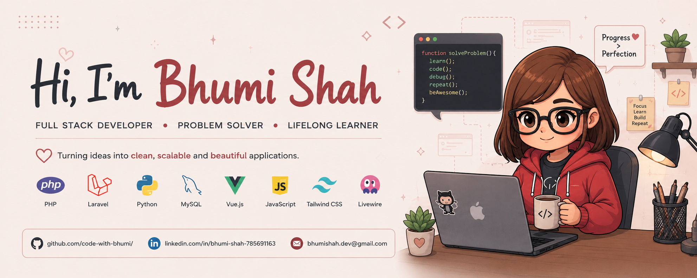

I'm **Bhumi**, a full-time **Full-Stack Developer** 👨‍💻 working remotely since **2021** 🚀. I love building modern web applications, exploring new technologies, and collaborating with others to create impactful solutions.

Reach me at: **bhumishah.dev@gmail.com**

## Connect with Me

    
    
    
    

## Languages and Tools

| Category | Languages & Tools |
|------------|------------------|
| **Programming Languages** | PHP, Python |
| **Backend Development** | Laravel, RESTful APIs, OOP, MVC |
| **Databases** | MySQL |
| **Frontend** | Vue.js, JavaScript, Livewire, Blade, Tailwind CSS, Alpine.js, HTML5, CSS3, jQuery, Bootstrap |
| **DevOps & Cloud** | Docker, AWS S3, Azure Boards |
| **API Tools** | Postman, Postman Collections |
| **Linux Administration** | Bash Scripting, Cron |
| **Tools & Platforms** | Git, Linux, hPanel |

### 💡 "Code. Learn. Build. Repeat."

